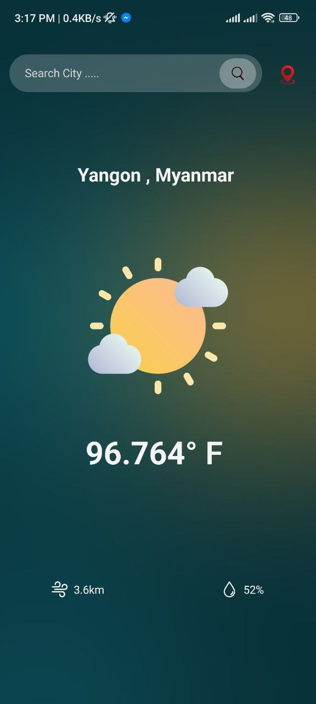
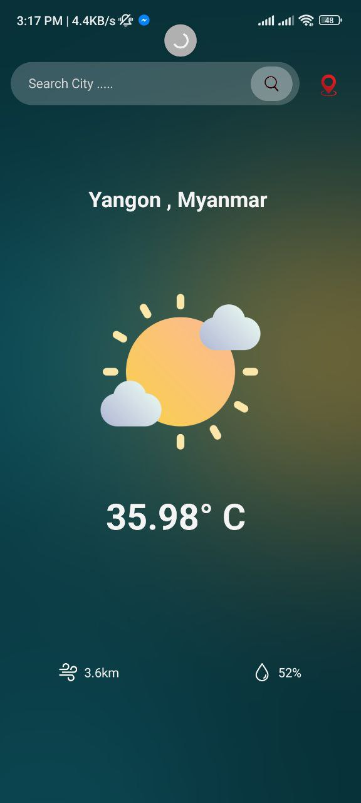
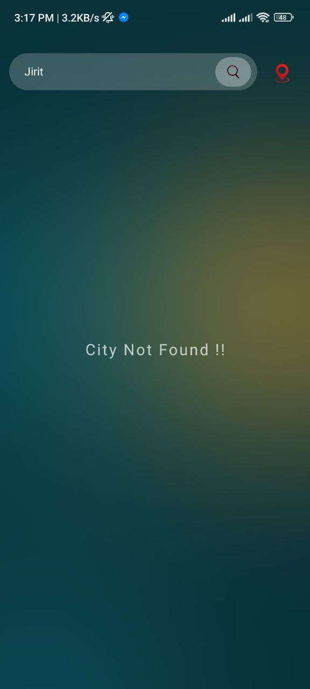

# React Native Coding Test - Weather App

## Authors

- [@yoonpyaepyaenyein](https://github.com/yoonpyaepyaenyein)

## Running the project

To run this project, open your desired simulator.

```bash
  cd your/directory
  git clone project
```

```bash
  cd project/

  yarn install

  npx react native start
```

## Screenshots

android

<p float="left">





</p>
