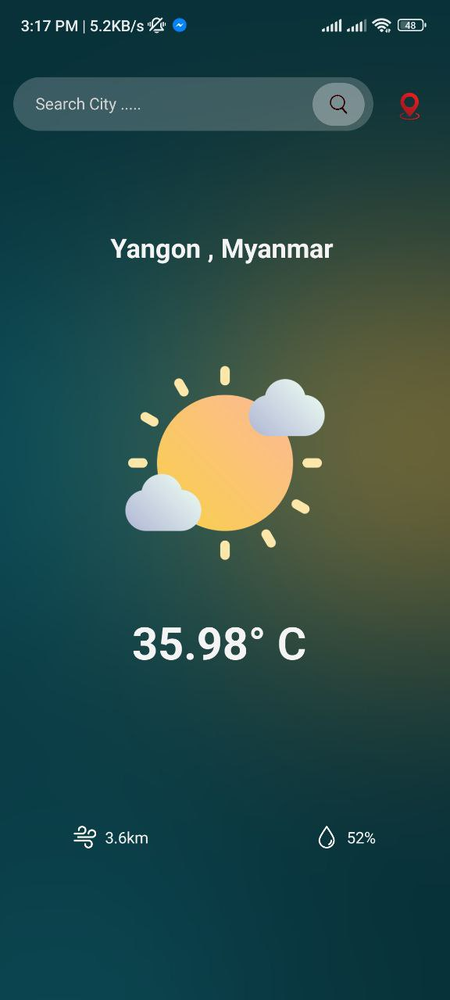
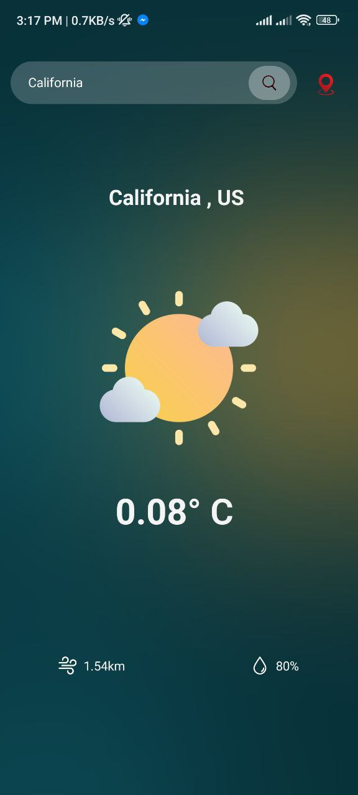

# React Native Skill Test

This is the coding test assigned to Chit Ko

## Authors

- [@yoonpyaepyaenyein](https://github.com/yoonpyaepyaenyein)

## Running the project

To run this project, open your desired simulator.

```bash
  cd your/directory
  git clone project
```

```bash
  cd project/

  yarn install

  npx react native start
```

\*Note that running profile mode is not supported for IOS simulator.

## Framework

[React Native](https://reactnative.dev/)

## Screenshots

android

<p float="left">





</p>
